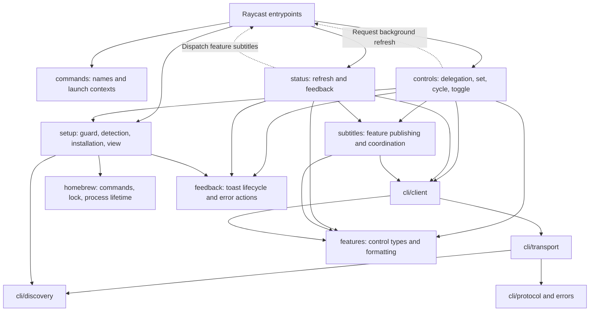

# Architecture

Pods Control has eight Raycast command entrypoints in `src/`. Keep those filenames and their manifest identifiers stable (`pods-status` and `manage-cli` among them). The folders below group the implementation by responsibility; none of them changes the CLI's contract.

## Finding the code

| Task                                               | Start here                                                                                               |
| -------------------------------------------------- | -------------------------------------------------------------------------------------------------------- |
| Follow a fixed listening-mode command              | `src/set-*.ts` → `controls/delegate-listening-mode.ts` → Cycle entrypoint → `controls/listening-mode.ts` |
| Change cycling or Conversation Awareness logic     | `src/controls/`                                                                                          |
| Understand a background launch payload             | `src/commands/launch-context.ts`                                                                         |
| Follow combined status reads and subtitle dispatch | `src/status/refresh.ts`                                                                                  |
| Understand subtitle ordering across processes      | `src/subtitles/coordination.ts`                                                                          |
| Inspect CLI arguments and confirmed-state handling | `src/cli/client.ts`                                                                                      |
| Inspect CLI version comparison                     | `src/cli/version.ts`                                                                                     |
| Inspect executable discovery and search paths      | `src/cli/discovery.ts`, `src/cli/preferences.ts`                                                         |
| Inspect JSON validation or error classification    | `src/cli/protocol.ts`, `src/cli/errors.ts`, `src/cli/transport.ts`                                       |
| Change CLI setup screens or actions                | `src/setup/screens.ts`, `view.tsx`, `lifecycle.ts`                                                       |
| Understand setup detection or installation         | `src/setup/detection.ts`, `developer-tools.ts`, `latest-release.ts`, `installation.ts`                   |
| Understand the pre-command CLI check               | `src/setup/guard.ts`, `navigation.ts`                                                                    |
| Understand Homebrew termination and locking        | `src/homebrew/commands.ts`, `lock.ts`, `process-lifetime.ts`                                             |
| Change state labels or symbols                     | `src/features/presentation.ts`                                                                           |
| Change control toasts or error actions             | `src/feedback/`                                                                                          |

## Module map

Solid arrows are imports. Dashed arrows are Raycast command launches. Shared types, constants, and presentation helpers are omitted.

Raycast metadata updates apply in the executing command's context. Fixed-mode commands therefore delegate to Cycle Listening Mode, and the status command dispatches confirmed values back to the feature commands. Preserve these launches when reorganizing files.

## Dependency rules

ESLint enforces these boundaries for production code. Keep `eslint.config.js` in sync with this list.

- Entrypoints route user and background launches. They may depend on feature modules; feature modules never import entrypoints.
- `commands/` owns command identifiers and launch payload validation. It depends only on `features/`.
- `features/` holds the tokens and labels for the user-facing controls on the connected device (listening mode and Conversation Awareness). It has no Raycast or Node dependencies.
- `cli/` owns the external CLI contract and execution. It never imports setup, controls, status, subtitles, or feedback.
- `subtitles/` reads state through the CLI client and publishes metadata. It never imports controls or status.
- `controls/` and `status/` coordinate their own workflows and talk to each other only through Raycast launches.
- `setup/` owns CLI detection, install, update, and recovery. `homebrew/` owns command execution, OS locks, and supervisor cleanup.
- `feedback/` owns shared Raycast feedback primitives and has no feature dependencies.
- Production modules never import tests or test helpers. Unit tests sit beside their modules; composed workflows, real-process tests, and macOS lock tests live in `src/test/integration/`.

Use direct imports. Avoid barrel files and generic workflow abstractions that hide command-specific behavior.

## Behavior contracts

These describe existing behavior. Changing any of them needs its own behavior review.

**Commands and delegation**

- Fixed-mode delegation keeps its guarded fallback. Setup belongs to the originating command, and a successful installation never resumes the original command.
- Invalid or legacy background contexts without a usable revision trigger a fresh read. A valid context may carry an explicit null state. User-initiated invalid contexts keep their existing error handling.
- Background commands stay silent, never start an installation, and never change a listening setting.
- Preserve command identifiers, preference keys, visible messages, action ordering, shortcuts, and CLI version references during structural maintenance.

**CLI client**

- Writes use confirmed readback. A no-op that confirms the requested state is accepted. Preserve invalid-envelope checks and process-failure precedence.
- A custom CLI path overrides automatic discovery, including when it is invalid. Preserve search order, arguments, timeouts, buffer limits, and bounded diagnostics.

**Locks and subtitles**

- Control operations and status snapshots take the global operation lock. Feature operations also take their channel lock. Metadata writes compare durable revisions under the metadata lock.
- Preserve lock filenames, revision JSON keys, lock acquisition order, and atomic revision writes. A delayed publication must not overwrite a newer operation.
- A control command requests a status refresh after releasing its operation lock, including after a failed CLI action. A lock acquisition failure does not run the CLI.
- The combined subtitle keeps its last confirmed value on transient or malformed total reads. Disconnection, unavailable controls, and partial reads keep their separate outcomes. Feature subtitles can reset independently.

**Setup and updates**

- Setup detection precedence, persistent completion and error screens, cancellation guards, and in-process pending promises stay unchanged.
- An update is offered when the latest release is newer than the installed CLI, when the latest check fails, or when the installed CLI is below `MIN_CLI_VERSION`. `MIN_CLI_VERSION` is a compatibility floor only; latest versions come from Homebrew (`brew info`, local tap, no `brew update`) or GitHub (`releases/latest`). The copied source-install command resolves `releases/latest`. User-facing docs link GitHub `HEAD`.
- Actions follow the current setup state: Homebrew install help only when Homebrew is missing, the source-install copy only for a manual CLI that needs an update, and no update or install-docs action on an up-to-date CLI.
- When Homebrew owns the formula but discovery finds no CLI, setup diagnoses before recommending: a keg without a usable executable gets `brew reinstall`; a usable keg executable gets `brew link`, or `brew link --overwrite` when Homebrew's `linked_keg` says it is already linked; an unreadable link status keeps the plain link. The keg path is diagnostic only and never joins `CLI_SEARCH_PATHS`. Homebrew is asked for link status only on this path.

**Homebrew processes**

- Homebrew holds its OS lock until descendant cleanup finishes, including timeout escalation and parent termination.
- The CLI transport and the Homebrew supervisor have different lifetimes; keep their execution mechanisms separate.

## Verification

See [TESTING.md](TESTING.md) for the test projects, conventions, and the full command list. Raycast rendering, HUD fallback, Homebrew installation, and AirPods or Beats hardware are not covered by automated tests; check those manually against a distribution build with compatible hardware connected.
