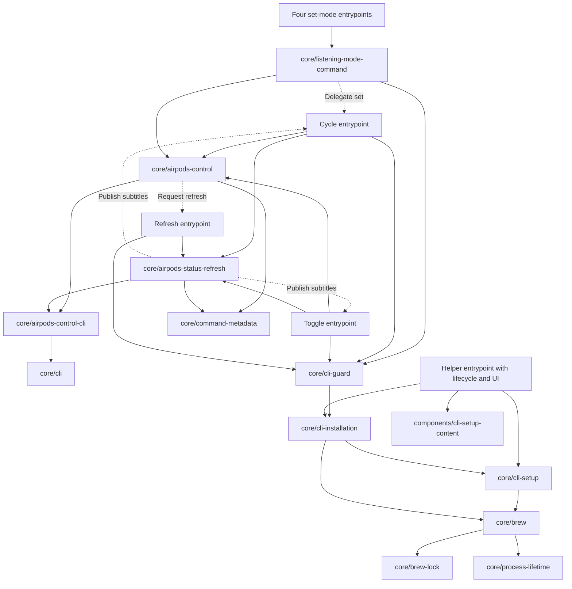
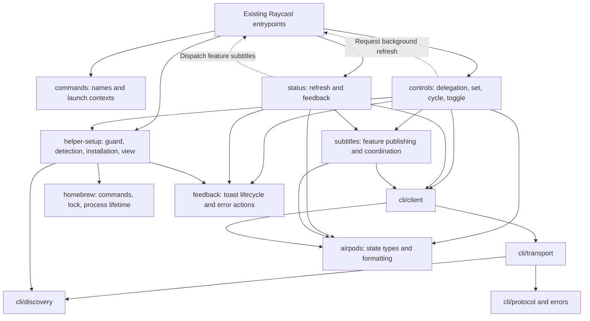

# Architecture

AirPods Control has eight Raycast command entrypoints. Keep those filenames and their manifest identifiers stable. The modules below group implementation by responsibility; none changes the helper's CLI contract.

## Finding the code

| Task                                                  | Start here                                                                                               |
| ----------------------------------------------------- | -------------------------------------------------------------------------------------------------------- |
| Follow a fixed listening-mode command                 | `src/set-*.ts` → `controls/delegate-listening-mode.ts` → Cycle entrypoint → `controls/listening-mode.ts` |
| Change cycling or Conversation Awareness logic        | `src/controls/`                                                                                          |
| Understand a background launch payload                | `src/commands/launch-context.ts`                                                                         |
| Follow combined status reads and subtitle dispatch    | `src/status/refresh.ts`                                                                                  |
| Understand subtitle ordering across processes         | `src/subtitles/coordination.ts`                                                                          |
| Inspect helper arguments and confirmed-state handling | `src/cli/client.ts`                                                                                      |
| Inspect helper version comparison                     | `src/cli/version.ts`                                                                                     |
| Inspect executable discovery                          | `src/cli/discovery.ts`                                                                                   |
| Inspect JSON validation or error classification       | `src/cli/protocol.ts`, `src/cli/errors.ts`, `src/cli/transport.ts`                                       |
| Change helper setup screens                           | `src/helper-setup/setup-view.tsx`, `setup-content.tsx`, `lifecycle.ts`                                   |
| Understand setup detection or installation            | `src/helper-setup/detection.ts`, `installation.ts`                                                       |
| Understand Homebrew termination and locking           | `src/homebrew/commands.ts`, `lock.ts`, `process-lifetime.ts`                                             |
| Change state labels or symbols                        | `src/airpods/presentation.ts`                                                                            |
| Change control toasts or error actions                | `src/feedback/`                                                                                          |

## Before the refactor

Solid arrows show dependencies. Dashed arrows show Raycast command launches. Shared types, constants, and presentation helpers are omitted for readability.



## Current architecture



Raycast metadata updates apply in the executing command's context. Fixed-mode commands therefore delegate to Cycle Listening Mode, and the status command dispatches confirmed values back to the feature commands. Preserve these launches when changing file organization.

## Dependency rules

- Entrypoints route user and background launches. They can depend on feature modules; feature modules must not import entrypoints.
- `commands/` owns command identifiers and launch payload validation. It depends only on AirPods state definitions.
- `airpods/` contains state types and formatting with no Raycast or Node dependencies.
- `cli/` owns the external helper contract and execution. It never imports setup, control workflows, status, subtitles, or feedback.
- `subtitles/` can read state through the CLI client and publish metadata. It never imports control or status workflows.
- `controls/` and `status/` coordinate their own workflows. They communicate through Raycast launches, not direct imports of each other.
- `helper-setup/` owns setup lifecycle and recovery. `homebrew/` owns command execution, OS locks, and supervisor cleanup.
- `feedback/` owns shared Raycast feedback primitives and has no feature dependencies.
- Production modules never import tests or test helpers. Unit tests stay beside their modules; composed workflows, real-process tests, and macOS lock tests live in `src/test/integration/`. Follow [TESTING.md](TESTING.md) for Given/When/Then, fixture ownership, and suite selection.

Use direct imports. Avoid barrel files that hide dependencies and generic workflow abstractions that obscure command-specific behavior. ESLint enforces the folder boundaries for production code.

## Behavior contracts

These rules describe existing behavior. A future change to any rule needs its own behavior review.

- Fixed-mode delegation retains its guarded fallback. Setup belongs to the originating command, and successful installation never resumes the original AirPods action.
- CLI writes use confirmed readback. A no-op that confirms the requested state is accepted by the client. Preserve invalid-envelope checks and process-failure precedence.
- Custom CLI paths override automatic discovery, including when invalid. Preserve search order, arguments, timeouts, buffer limits, and bounded diagnostics.
- Invalid or legacy background contexts without a usable revision trigger a fresh read. A valid context can carry an explicit null state. User-initiated invalid contexts retain their existing error handling.
- Control operations and status snapshots use the global operation lock. Feature operations also take their channel lock. Metadata writes compare durable revisions under the metadata lock.
- Preserve lock filenames, revision JSON keys, lock acquisition order, and atomic revision writes. A delayed publication must not overwrite a newer operation.
- A control command requests status refresh after releasing its operation lock, including after a failed CLI action. A lock acquisition failure does not run the CLI.
- The combined subtitle preserves its last confirmed value on transient or malformed total reads. Disconnection, unavailable controls, and partial reads retain their separate outcomes. Individual feature subtitles can reset independently.
- Background commands stay silent, do not initiate installation, and never change AirPods settings.
- Setup detection precedence, persistent completion and error screens, cancellation guards, and in-process pending promises remain unchanged.
- Helper setup offers Homebrew or manual updates when the live latest is newer than the install, when the latest check fails, or when the installed helper is below `MIN_CLI_VERSION`. Latest versions come only from Homebrew (`brew info`) or GitHub (`releases/latest`); `MIN_CLI_VERSION` is a compatibility floor, not a latest source, URL pin, or install-command pin. The copied source-install command resolves `releases/latest` so the installer tag matches the installed release. User-facing docs follow GitHub `HEAD`. An up-to-date helper that meets the minimum shows status without an update action. Latest Homebrew versions come from the local tap without running `brew update`.
- Homebrew retains its OS lock until descendant cleanup finishes, including timeout escalation and parent termination. The CLI transport and Homebrew supervisor have different lifetimes; keep their execution mechanisms separate.
- Preserve command identifiers, preference keys, visible messages, action ordering, shortcuts, and helper version references during structural maintenance.

## Verification

Run from the extension directory:

```sh
npm test
npm run test:unit
npm run test:integration
npm run type-check
npx --no-install prettier --check src .prettierrc eslint.config.js package.json tsconfig.json vitest.config.ts
npm run lint
npm run build
npm run test:coverage
```

Vitest separates unit, component, portable integration, and macOS integration projects. Every macOS integration case skips explicitly on other platforms. Each resource-owning test creates and removes its own temporary support directory.

The tests cover manifest entrypoints, launch contexts, helper transport and state validation, subtitle ordering, setup transitions, feedback, and Homebrew process ownership. Transport integration tests use temporary fake helpers. The macOS lock tests run real `lockf` and supervised fixture processes. They do not run Homebrew installation or AirPods operations.

Raycast and hardware checks remain separate from those tests. For runtime validation, exercise foreground and background launches, fixed-mode delegation and fallback, toast/HUD completion with the window open and closed, and setup loading/error/refresh states. Confirm the extension is running the intended distribution build. Use compatible connected hardware for device-operation checks.
